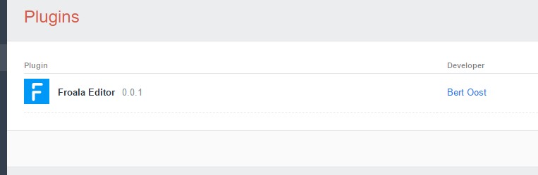
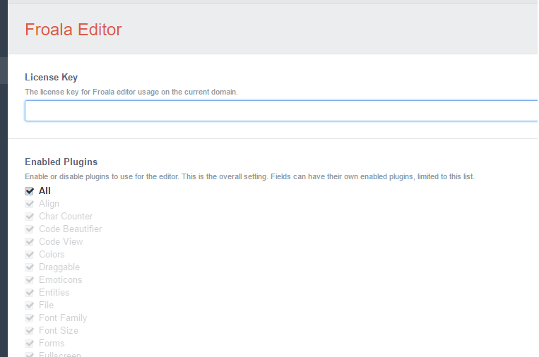
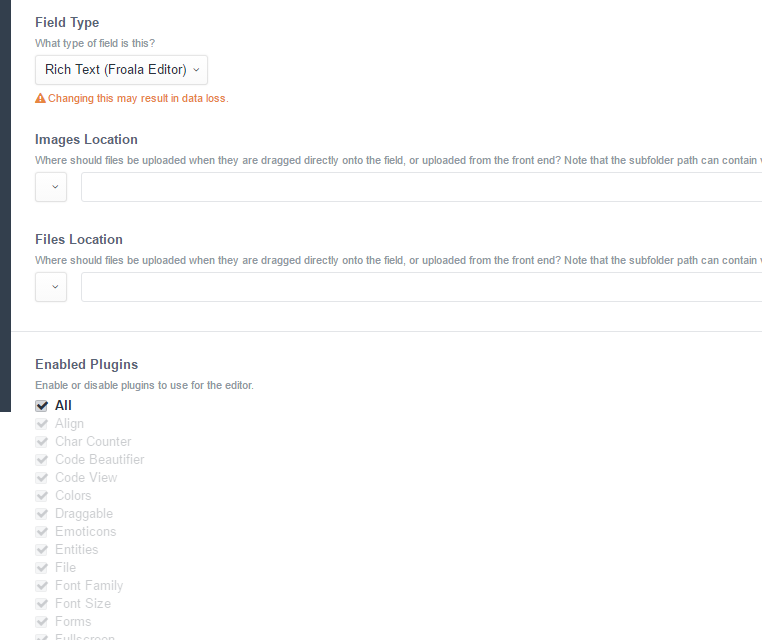
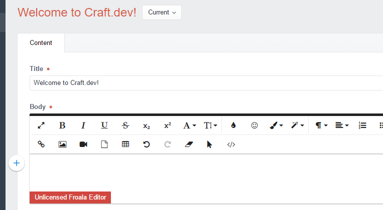

# Froala WYSIWYG editor for Craft CMS (v2)

The implementation of the Froala Editor (license not included) for Craft CMS

__[Check the Craft CMS v3 version here](https://github.com/froala/Craft-3-Froala-WYSIWYG/)__

## Known issue

- Inserting links to selected text is adding links to the bottom of the field
- Inserting links to images is adding links to the bottomg of the field

Sorry for the inconvience. We're working on these annoying issues. But we decided to release a new version because of some missing important other features (like saving links the Craft way)

## Installation

Chose one of the options to install 

### Composer installation

It is possible to install the plugin for Craft 2. Craft is not yet working with composer. It 
uses the composer installers package to move the package to craft/plugins/ folder.

```
composer require froala/craft-froala-editor
```

After requiring the plugin package, it is moved to `craft/plugins/`. 
You still need to go to the Craft Plugins page to install and enable it.

__Note:__ it doesn't use Froala Editor sources from composer yet. This will be there for the Craft 3 version of course.

### Manual installation

1. Download the zip at the top right
1. Extract the files from the zip file
1. Rename the folder to "froalaeditor"
1. Copy the froalaeditor/ folder to your craft/plugins/ folder
1. Login the control panel of your Craft installation and navigate to Settings > Plugins
1. Hit "install" and the plugin will be installed.

To enable the editor correctly, you should have a purchased a license on [www.froala.com](https://www.froala.com/wysiwyg-editor/pricing).

Once you have a license, for your domain, you can enter the license key in the plugin settings.

## Features
- Ability to set your license key in plugin settings
- Ability to disable/enable editor plugins via settings
- Creating fields defined as Richtext Froala Editor
- Ability to change enabled plugins per field (inherit from generic plugin settings)
- Configuration of Craft Asset sources for image/file uploads
- Configuration of custom CSS file to be loaded relative from the site or from a plugin resource

## License
Froala Editor is a beautiful WYSIWYG editor for editing web pages.

Therefor the editor needs a license. You can by one at [their website](https://www.froala.com/wysiwyg-editor/pricing).

Once purchased a license, you can enter the license key in your Craft CMS settings page.

### Screenshots







